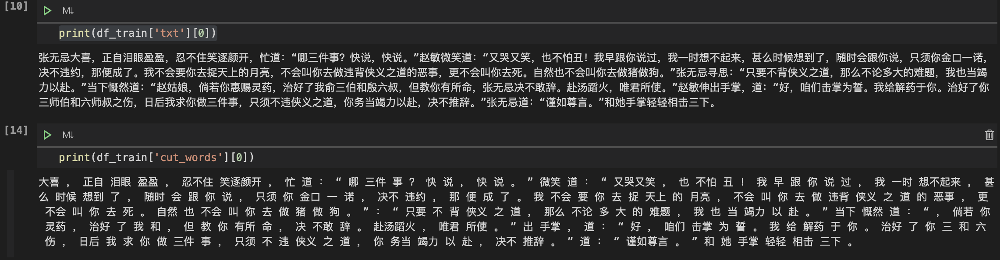
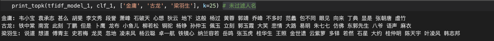
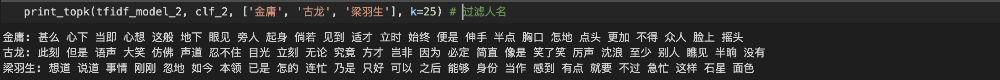

#武侠小说分类器

SA19011081-王新

---

##实验内容

​		不同的作者一般会有不同的写作风格，武侠小说也是如此，比如下面的两个片段分别是金庸和古龙的作品，如果熟悉这两位作者，那么便可以进行分辨。

```
	想通了这一节，心情登时十分舒畅，一声长啸，倒纵出洞，在半空轻轻巧巧一个转身，向前纵出，落下地来，站定脚步，这才睁眼，只见双足刚好踏在危崖边上，与崖缘相距只不过两尺，适才纵起时倘若用力稍大，落下时超前两尺，那便堕入万丈深谷，化为肉泥了。他这一闭目转身，原是事先算好了的，既已打定了主意，见到魔教中人出手便杀，心中更无烦恼，便来行险玩上一玩。 --金庸
	
	他不知道，甚至连想都没有去想过！现在他已走到这，前面呢？前面真的是死亡？当然是！他眼中已有死亡，他手握着的也是死亡，他的刀象徵着的就是死亡！漆黑的刀，刀柄漆黑，刀鞘漆黑。这柄刀象徵着的虽然是死亡，却是他的生命！--古龙
```

​		即使不熟悉这两位作者，在阅读上面的文字后也能够体会得到二者的区别，这是因为作者的用词习惯，修辞手法等均有差别。在阅读大量的相关作品后，我们便可能猜测出一篇完全陌生的小说的作者是谁。猜测作者的过程可以看作一个分类问题，但是我们很难说清具体的分类过程。

​		本次实验的目的主要是设计不同的算法来完成上面的作者分类问题，并从中探究程序分类的依据，并结合实际进行一些探讨。

## 系统实现

### 整体框架


整个系统主要包括：数据获取、数据处理以及模型设计，需要注意的是小说类文学与普通文章略有不同，尤其是武侠小说的篇幅一般比较长，因此数据处理需要对其进行分割

在数据处理中采用了两种不同的特征提取方式，包括传统的手工设计特征（这里采用的是tf-idf矩阵）以及词向量（Word Embeddings）。最后对不同的输出特征采用不同的机器学习模型，基于实验结果分析各自的特点。

下面对各个模块进行逐一介绍

###数据获取及处理

#### 数据获取

本次实验主要针对武侠小说的分类，因此在[武侠小说网站](https://www.xstt5.com/writer/wuxia.html)爬取了金庸、古龙、梁羽生三位作者的相关作品的txt文件，总数据集大小约100M

#### 数据处理

数据处理模块主要包括文本分割及分词、数据集划分与特征提取三个部分

- 文本分割及分词

  - 文本分割是将txt文件分割成一定长度范围内的字符串，实验中选取的长度范围是[300, 500]，在分割后总计约**60000**条数据
  - 分词采用的是jieba，需要注意的是武侠小说中的人名可能对实验结果造成比较大的影响，因为一般的文本分类很少有这种对分类结果影响巨大的词汇，因此在分词的过程中可以选择过滤掉人名，可以通过jieba的词性实现。

  下面是分割后的文本以及过滤人名后的分词示例：

  

  可以看到利用jieba能够过滤**张无忌、赵敏、赵姑娘**等词

- 数据集划分：train  : valid : test = 8 : 1 : 1，各部分的是数据类平衡的，其中valid数据集用于在训练过程中检验模型的状态，收敛情况等，test数据集用于模型最后的evaluation，在不做说明的情况下，下面的实验结果均指在test数据集获得的。

- 特征提取：

  - 词向量 (Word Embeddings)通过对大量的文本语料进行训练，对每一个词 (word type) 返回一个n维的实数向量，本次实验中选取的是[中文维基百科词向量](https://pan.baidu.com/s/19wQrclyynOnco3JBvnI5pA)

  - tf-idf是结合**TF(词频)和IDF(逆文档频率)**计算得到的一个指标，tf-idf可以评估一个单词的重要性。本次实验利用sklearn提供的**TfidfVectorizer**对上面分割后的文档进行处理得到相应的tf-idf矩阵，为了控制token的数量，在这里仅选取的长度大于1并且出现的频率在一定范围内的中文token。

    ```python
    TfidfVectorizer(token_pattern=r"(?u)\b[\u4e00-\u9fa5]{2,}\b", max_df=0.5, min_df=2e-2).fit(cut_docs)
    ```

###模型设计及实验结果

实验中采用了两种不同的特征提取方式，tf-idf矩阵以及词向量，针对不同的特征采用了不同的机器学习模型。针对tf-idf采用的是一个传统的分类模型**RidgeClassifier**，通过直接调用sklearn实现，针对词向量采用的是一个深度学习模型**TextCNN**，通过pytroch编码实现。下面针对不同特征分别阐述相关实验结果

#### tf-idf

- 模型介绍：RidgeClassifier是岭回归器的一个分类器变体，相比于其它线性模型，如LinearRegression，RidgeClassifier速度更快。

- 实验结果

  - 训练数据分析：tf-idf向量的维度近700，因此利用将训练集上的数据PCA降维到二维平面进行可视化，结果如下：

    

    从上图可以看出，三位作者的输入分布是有区别的，也可以看出古龙与其他两位作者的区别更加明显。降维结果可以说明实验中提取的tf-idf矩阵的有效性

  - 模型可解释性：线性模型相比于深度学习模型最大的优势之一就是模型的可解释性，在模型训练结束后，我们可以根据tf-idf向量不同维度的重要性选择出模型判断的主要因素，具体代码如下：

    ```python
    def print_topk(vectorizer, clf, class_labels, k=10):
      	# 输入模型判断的topk个因素
        feature_names = vectorizer.get_feature_names()
        for i, class_label in enumerate(class_labels):
            topk = np.argsort(clf.coef_[i])[-k:]
            print("%s: %s" % (class_label, " ".join(feature_names[j] for j in topk[::-1])))
    ```

    

    

    通过上图可以看出，在未过滤人名的情况下，模型分类的关键因素也倾向于人名，例如`韦小宝、小鱼儿`，这与我们的常识也很温和。当过滤人名后，关键因素则倾向于在文章中使用的一些语气词、连接词等，可以看到三位作者的用词习惯的确有很大区别

  - 分类结果（混淆矩阵）：采用过滤人名后的数据集，类别从上到下分别是金庸、古龙、梁羽生

    

    从整体来看，模型的分类准确率比较高，从局部看，模型对于金庸与梁羽生的作品更加容易“混淆”，例如金庸的作品更加容易错分为梁羽生，这与PCA降维分析基本一致，即古龙的数据分布与其他两位作者的区别更加明显

####词向量化 (Word Embedding)

- 模型介绍：

  

  上图是TextCNN的模型结构，TextCNN主要包括以下四层结构

  - 嵌入层：将输入的文本序列编码成$n\times k$的矩阵，实验中利用的预训练的[中文维基百科词向量](https://pan.baidu.com/s/19wQrclyynOnco3JBvnI5pA)
  - 卷积层：在TextCNN中，卷积核的宽度与词向量的维度等宽，因此卷积核只进行一维的滑动。卷积核的高度，即窗口值，可以理解为N-gram模型中的N，即利用的局部词序的长度，在实验中选取了三组不同的窗口值`(2, 3, 4)`
  - 池化层：实验中选取最大值池化
  - 全连接层：利用池化层的输出进行分类

- 实验结果：

  以下实验均在过滤人名数据集上进行

  - 训练结果如下：

    

    左图是训练过程中平均损失的变化图像，右边是在valid数据集上的micro-precision变化图像

  - 测试结果（混淆矩阵）：利用valid数据集选出最佳模型并在test数据集上得到如下结果:

    

    从混淆矩阵可以看到，利用TextCNN得到的测试结果优于线性模型，并且如果对超参进行精心选择应该可以得到更好的结果。相对于线性模型，深度学习模型的表达能力更强，这也是结果更好的主要原因之一，但是由于更加复杂，模型的训练代价也更高，并且相对于线性模型，深度学习模型的可解释性更弱。

## 总结

本次实验中，通过对一种比较特殊的文体-武侠小说进行了分类器的设计，主要包括数据的特征提取以及模型的选择和设计。

在实验中，首先对数据进行手工特征提取（tf-idf矩阵）以及PCA降维分析获取了不同作家创作内容的分布特征，通过线性模型完成了分类任务，并且最终结果满足之前的数据分布，通过对模型的可解释分析进一步了解了模型分类的主要依据，并且结果与直觉相吻合。

之后利用词向量进行特征获取，并在此基础上搭建TextCNN进行分类任务，在线性模型的基础上提升了分类的准确率。

通过这次实验，我对NLP以及相关工具有了更加深入的理解，在实验过程中提出了一些猜想并且通过实验结果进行了验证，这让我觉得很有意思，总体而言很有收获。


*注：相关代码均在src中*

